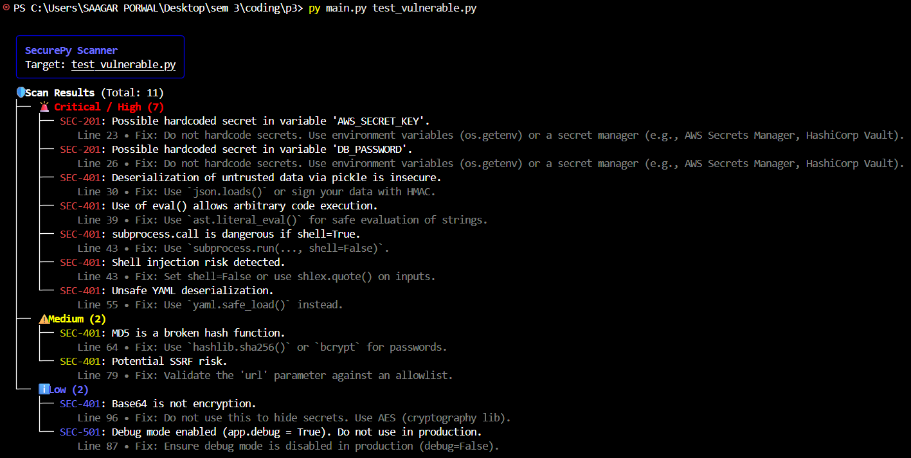

# 🛡️ SecurePy: Enterprise SAST Scanner


**SecurePy** is a specialized **Static Application Security Testing (SAST)** tool designed for modern DevSecOps pipelines. Unlike simple grep-based scanners, SecurePy uses **Abstract Syntax Trees (AST)** to analyze the structure and logic of Python code, allowing it to detect complex vulnerabilities like insecure logic, hardcoded secrets, and injection risks.

It features a **"Hacker-style" Rich CLI** for local audits and integrates natively with **GitHub Actions** to enforce security quality gates (blocking builds if critical bugs are found).

---

## 🚀 Key Features

* **🧠 Deep AST Analysis:** Parses code into tree structures to understand variable assignments, function calls, and imports—minimizing false positives.
* **💻 Professional CLI Dashboard:** Built with the `Rich` library to provide interactive, color-coded, and tree-structured reports in the terminal.
* **🔒 Comprehensive Ruleset:**
    * **Secrets Detection:** AWS Keys, API Tokens, Database Passwords.
    * **Injection Attacks:** SQL Injection (f-strings/concatenation), Shell Injection (`subprocess`).
    * **Dangerous Functions:** `eval()`, `exec()`, `pickle.loads()`, `yaml.load()`.
    * **Misconfigurations:** Debug mode enabled in production.
* **🐳 Dockerized:** Runs anywhere without dependency hell.
* **🛑 CI/CD Enforcement:** Returns non-zero exit codes to break the build in CI pipelines when vulnerabilities are detected.

---

## 📸 Screenshots

### The "Hacker" CLI Dashboard



## 🛠️ Tech Stack

* **Core Engine:** Python 3.11 (`ast` module)
* **UI/Reporting:** `Rich` (Terminal formatting)
* **Deployment:** Docker & Docker Compose
* **CI/CD:** GitHub Actions (Automated Workflows)

---

## 📦 Installation & Usage

You can run SecurePy directly via Python or inside a Docker container.

### Option 1: Local Python Setup

1.  **Clone the repository:**
    ```bash
    git clone [https://github.com/SagarPorwal10/SecurePy-Scanner.git](https://github.com/SagarPorwal10/SecurePy-Scanner.git)
    cd SecurePy-Scanner
    ```

2.  **Install dependencies:**
    ```bash
    pip install -r requirements.txt
    ```

3.  **Run the scanner:**
    ```bash
    python main.py test_vulnerable.py
    ```

### Option 2: Run with Docker (Recommended)

This ensures the tool runs in an isolated environment exactly as it does in the CI/CD pipeline.

1.  **Build the Image:**
    ```bash
    docker build -t securepy .
    ```

2.  **Run the Scanner:**
    * **Linux/Mac:**
        ```bash
        docker run -v $(pwd):/scan securepy /scan/test_vulnerable.py
        ```
    * **Windows (PowerShell):**
        ```powershell
        docker run -v ${PWD}:/scan securepy /scan/test_vulnerable.py
        ```

---

## ⚙️ How It Works

1.  **Parsing:** The tool reads the target Python file and compiles it into an Abstract Syntax Tree (AST).
2.  **Traversal:** Custom `NodeVisitor` classes walk through the tree.
    * *Example:* When it finds a `Call` node (function call), it checks if the name matches `eval` or `subprocess.call`.
    * *Example:* When it finds an `Assign` node, it checks if the variable name contains `PASSWORD` and the value is a string.
3.  **Reporting:** Findings are aggregated, scored by severity (Critical, High, Medium, Low), and presented with specific **Remediation Advice**.

---

## 🚦 CI/CD Pipeline Integration

This repository includes a pre-configured GitHub Action located at `.github/workflows/security_audit.yml`.

**Workflow Logic:**
1.  **Trigger:** Pushes to `main` branch.
2.  **Action:**
    * Spins up an Ubuntu runner.
    * Installs dependencies (`rich`).
    * Runs `main.py` against the codebase.
3.  **Outcome:**
    * ✅ **Clean:** Build passes.
    * ❌ **Vulnerable:** Build fails (Exit Code 1), preventing the merge.

---

## 🤝 Contributing

Contributions are welcome! Please follow these steps:
1.  Fork the repository.
2.  Create a feature branch (`git checkout -b feature/NewRule`).
3.  Commit your changes.
4.  Push to the branch.
5.  Open a Pull Request.

---

## 📄 License

This project is licensed under the MIT License - see the [LICENSE](LICENSE) file for details.

---

**Built by [Sagar Porwal](https://github.com/SagarPorwal10)** *Cybersecurity Engineering Portfolio Project*
